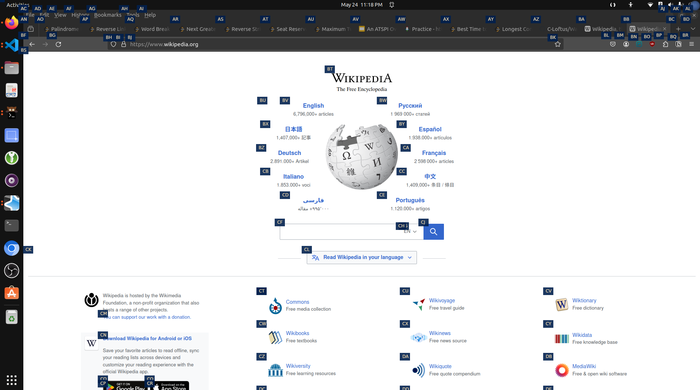

<h1 align="center">Watercolor</h1>

Click linux desktop gui elements by dictating a label 

## Setup

_Note: This repository is a work in progress and is primarily intended as a proof of concept_

1. Clone this repo into your Talon user directory
2. Install the `libgirepository1.0-dev` and `gir1.2-atspi-2.0` packages
    * (_These packages are the names in the Ubuntu repos, but may differ in your distro_)
4. Run `make run` to start the atspi server.
5. Say `color toggle` to add colored hats over a11y elements
6. Say `color <watercolor_hint>` with the Talon phonetic alphabet to click an element

> [!NOTE]
> You must have the atspi-server running via `make run` in order to say Watercolor commands

## Caveats

- Many applications don't implement atspi properly, some not at all
  - Issues can include wrong state labels on elements, failure to implement clicking on elements, outputting the wrong events on document changes, or incorrectly caching elements
- The Python bindings to libatspi are not designed to handle high throughput connections and can be slow. Depending on interest, I may port the backend to the [rust atspi implementation](https://github.com/odilia-app/atspi)

## Support and Debugging

- Say `color inspect <user.watercolor_hint>` to inspect an a11y element and its properties
- Use [accerciser](https://gitlab.gnome.org/GNOME/accerciser) for checking atspi compliance
- Check `Watercolor/atspi_log.txt` and report any issues once confirmed

For any personalized support or inquiries, I offer accessibility software consulting services. Please [reach out to me](https://colton.place/contact/) if you have a question about Talon, screen readers, front-end design, atspi, or any other accessibility software.
