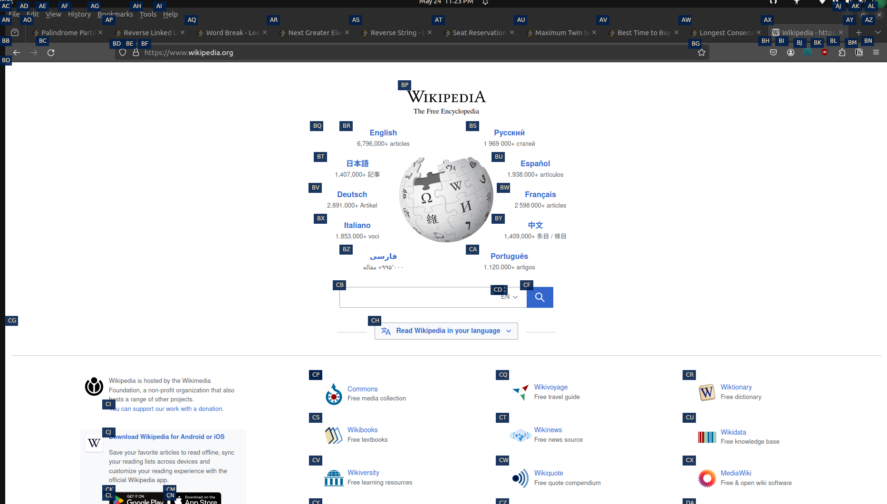

<h1 align="center">Watercolor</h1>

Click linux desktop gui elements by dictating a label 

## Setup

_Note: This repository is a work in progress_

1. Clone this repo into your Talon user directory
2. Install the `libgirepository1.0-dev` and `libgir1.2-atspi-2.0` packages
3. Run `make run` to start the atspi server.
4. Say `color toggle` to add colored hats over a11y elements
5. Say `color <watercolor_hint>` with the Talon phonetic alphabet to click an element

> [!NOTE]
> You must have the atspi-server running via `make run` in order to use Watercolor commands

## Caveats

- Many application don't implement atspi properly, some not at all
  - Some don't implement clicking on a11y elements, others output the wrong events, or incorrectly cache elements
- The Python bindings to libatspi are sometimes slow. Depending on interest, I may port the backend to the [rust atspi implementation](https://github.com/odilia-app/atspi)

## Support

I offer accessibility software consulting services. Please [reach out to me](https://colton.place/contact/) if you have a question about Talon, screen readers, front-end design, atspi, or any other accessibility software.
